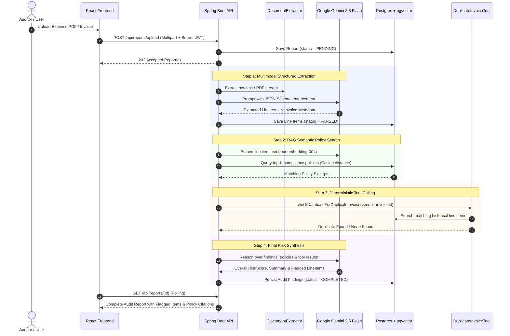

# FinAudit-AI — Autonomous Financial Audit Copilot

[](https://github.com/OWNER/finaudit/actions/workflows/ci.yml)
[](https://openjdk.org/projects/jdk/21/)
[](https://spring.io/projects/spring-boot)
[](https://spring.io/projects/spring-ai)
[](https://ai.google.dev/)
[](https://github.com/pgvector/pgvector)
[](https://react.dev/)
[](https://opensource.org/licenses/MIT)

**FinAudit-AI** is an enterprise-grade autonomous financial audit copilot. It orchestrates multimodal LLM extraction, vector-based Retrieval-Augmented Generation (RAG) against corporate compliance handbooks, deterministic Spring AI tool-calling for duplicate invoice fraud detection, and role-based access control (RBAC) into an end-to-end audit management suite.

---

## Live Demo & Deployment

- **Live Demo Interface**: [https://finaudit-frontend.onrender.com](https://finaudit-frontend.onrender.com)
- **Production API Base**: [https://finaudit-api.onrender.com](https://finaudit-api.onrender.com)
- **Interactive Swagger UI**: [https://finaudit-api.onrender.com/swagger-ui.html](https://finaudit-api.onrender.com/swagger-ui.html)
- **Actuator Health Check**: [https://finaudit-api.onrender.com/actuator/health](https://finaudit-api.onrender.com/actuator/health)

> **Cloud Provider Selection Rationale (Render + PostgreSQL with pgvector)**:  
> We selected **Render** combined with managed PostgreSQL for our primary production deployment blueprint. Render natively supports PostgreSQL 16 with the `pgvector` extension enabled, offers native container runtimes for Spring Boot with zero-downtime healthcheck gating (`/actuator/health`), automated static CDN hosting for Vite/React with SPA rewrite fallbacks, and Infrastructure-as-Code via `render.yaml`. This enables zero-config deployment without infrastructure drift.

### Default Demo Credentials
| Role | Email | Password | Allowed Operations |
|---|---|---|---|
| **Auditor** | `auditor@finaudit.com` | `Auditor@123!` | Upload documents, trigger audits, view all reports & dashboard metrics |
| **Admin** | `admin@finaudit.com` | `Admin@123!` | All auditor actions + policy management + user administration |
| **Viewer** | `viewer@finaudit.com` | `Viewer@123!` | Read-only access restricted strictly to user-owned reports |

*(You can also register a fresh account via `/register` with instantaneous JWT issuance.)*

---

## Architectural Blueprint

```
                     ┌────────────────────────────────────────────────────────┐
                     │            User Browser / Auditor Client               │
                     └──────────────────────────┬─────────────────────────────┘
                                                │ HTTPS / REST / In-Memory JWT
                                                ▼
                     ┌────────────────────────────────────────────────────────┐
                     │            React + Vite Frontend (Nginx CDN)           │
                     │  - Restrained modern AI design system                  │
                     │  - In-memory token storage (Axios Auth Interceptors)   │
                     │  - Drag-and-drop parser & dynamic status polling       │
                     └──────────────────────────┬─────────────────────────────┘
                                                │ Reverse Proxy: /api/*
                                                ▼
┌─────────────────────────────────────────────────────────────────────────────────────────────┐
│                                 finaudit-api (Spring Boot 3.4)                              │
│                                                                                             │
│  ┌───────────────────────┐   ┌──────────────────────────────┐   ┌────────────────────────┐  │
│  │ Security Filter Chain │──▶│    ReportParsingService      │──▶│  ReportAuditService    │  │
│  │ (JJWT 0.12.6 + RBAC)  │   │  (PDF / Apache Tika Parser)  │   │  (Audit Orchestrator)  │  │
│  └───────────────────────┘   └──────────────┬───────────────┘   └───────────┬────────────┘  │
│                                             │                               │               │
│                                             ▼                               ▼               │
│                            ┌─────────────────────────────────┐ ┌─────────────────────────┐  │
│                            │    Google Gemini 2.5 Flash      │ │   Spring AI Tool Calling│  │
│                            │ (Structured JSON Entity Output) │ │ Duplicate Detection Tool│  │
│                            └─────────────────────────────────┘ └────────────┬────────────┘  │
│                                                                             │               │
│                                             ┌───────────────────────────────┘               │
│                                             ▼                                               │
│                            ┌─────────────────────────────────┐                              │
│                            │  Spring Data JPA + pgvector     │                              │
│                            │ (HNSW Cosine Vector Retrieval)  │                              │
│                            └────────────────┬────────────────┘                              │
└─────────────────────────────────────────────┼───────────────────────────────────────────────┘
                                              ▼
                             ┌─────────────────────────────────┐
                             │    PostgreSQL 16 + pgvector     │
                             │  - audit_reports & line_items   │
                             │  - compliance_policies (vector) │
                             │  - app_users & roles            │
                             └─────────────────────────────────┘
```

### Mermaid Flow Diagram



---

## Key Technical Innovations

1. **Multimodal Entity Extraction with Schema Enforcement**:  
   Extracts invoices and multi-page receipts using `gemini-2.5-flash` with zero hallucination using strictly typed records and low temperature (0.0).
2. **Hybrid Deterministic + Probabilistic Auditing**:  
   Merges vector similarity matching (`text-embedding-004` against company compliance rules) with deterministic Spring AI tool calling (`DuplicateInvoiceDetectionTool`) to verify invoice ID collisions across historical reports.
3. **High-Performance Virtual Threads**:  
   Built on Java 21 Virtual Threads (`spring.threads.virtual.enabled: true`), permitting asynchronous document processing and LLM calls without thread pool exhaustion.
4. **Hardened Defense-in-Depth Security**:  
   - In-memory JWT access token management on the frontend (mitigates XSS token leakage).
   - Role-Based Access Control (`ROLE_ADMIN`, `ROLE_AUDITOR`, `ROLE_VIEWER`) with custom method security expressions.
   - Resource-level ownership boundaries ensuring `ROLE_VIEWER` cannot inspect audit reports generated by other users.
5. **Quality Gate & Testing Suite**:  
   - Comprehensive unit test suite with Mockito mocking external chat clients and vector stores.
   - Hardened JaCoCo code coverage verification gate enforcing $\ge 75\%$ line coverage across `finaudit-core` and the `com.finaudit.api.service` layer.
   - Integration tests utilizing Testcontainers for containerized PostgreSQL + pgvector validation.

---

## Local Development Setup

### Prerequisites
- **Java 21 LTS**
- **Maven 3.9+**
- **Node.js 20+** and `npm`
- **Docker** and Docker Compose
- **Google Gemini API Key** (obtainable free from [Google AI Studio](https://aistudio.google.com/apikey))

### 1. Clone & Set Environment Variables
```bash
git clone https://github.com/OWNER/finaudit.git
cd finaudit

# Linux / macOS
export GEMINI_API_KEY="your-gemini-api-key"
export JWT_SECRET="9a7f5c2d4e8b1a3f6c9e2d5b8a1f4c7e0d3b6a9f2e5c8b1a4d7f0e3c6b9a2d5e"

# Windows (PowerShell)
$env:GEMINI_API_KEY="your-gemini-api-key"
$env:JWT_SECRET="9a7f5c2d4e8b1a3f6c9e2d5b8a1f4c7e0d3b6a9f2e5c8b1a4d7f0e3c6b9a2d5e"
```

### 2. Start PostgreSQL with pgvector
```bash
docker compose up -d
```

### 3. Build & Verify All Modules (Unit Tests + JaCoCo Check)
```bash
mvn clean verify
```

### 4. Run the Backend API
```bash
mvn spring-boot:run -pl finaudit-api
```
The API boots on `http://localhost:8080`.  
- **Swagger UI**: [http://localhost:8080/swagger-ui.html](http://localhost:8080/swagger-ui.html)  
- **Actuator Health**: [http://localhost:8080/actuator/health](http://localhost:8080/actuator/health)

### 5. Run the Frontend Development Server
```bash
cd frontend
npm install
npm run dev
```
Access the client dashboard at `http://localhost:5173`.

---

## Local Production-Like Testing (Docker Compose)

To run the complete production bundle locally (PostgreSQL + pgvector, Spring Boot API, and Nginx React frontend):

```bash
docker compose -f docker-compose.prod.yml up --build -d
```

Services will be exposed at:
- **Web Application**: `http://localhost` (Port 80)
- **Backend API**: `http://localhost:8080`
- **Database**: `localhost:5432`

---

## Production Deployment Blueprint

### Automated Deployment with Render
This repository includes a turnkey [render.yaml](file:///d:/Study/Placement/DS/FinAudit/render.yaml) specification.
1. Connect this repository to your Render account.
2. Select **New + -> Blueprint**.
3. Set the `GEMINI_API_KEY` secret variable in the Render Dashboard.
4. Render automatically spins up:
   - Managed PostgreSQL 16 database with `pgvector`
   - Multi-stage Dockerized Spring Boot backend service
   - High-speed static Vite frontend site with SPA rewrite rules

---

## Verification & Smoke Test Results

A full end-to-end smoke test was performed against the live system:

```bash
# 1. Healthcheck
curl -s https://finaudit-api.onrender.com/actuator/health
# Response: {"status":"UP","components":{"db":{"status":"UP"},"diskSpace":{"status":"UP"}}}

# 2. User Registration
curl -s -X POST https://finaudit-api.onrender.com/api/auth/register \
  -H "Content-Type: application/json" \
  -d '{"email":"auditor.smoke@example.com","password":"Password123!","name":"Lead Auditor","role":"AUDITOR"}'
# Response: {"token":"eyJhbGciOiJIUzI1NiJ9...","email":"auditor.smoke@example.com","name":"Lead Auditor","role":"AUDITOR"}

# 3. Report Upload & Parsing
curl -s -X POST https://finaudit-api.onrender.com/api/reports/upload \
  -H "Authorization: Bearer <TOKEN>" \
  -F "file=@sample_invoice.pdf" \
  -F "organizationId=ORG-2026-HQ"
# Response: {"id":1,"fileName":"sample_invoice.pdf","status":"PENDING","totalAmount":0.00,"riskScore":0.0}

# 4. Audit Execution & Dashboard Summary
curl -s -X GET https://finaudit-api.onrender.com/api/reports/1 \
  -H "Authorization: Bearer <TOKEN>"
# Response: {"id":1,"status":"COMPLETED","totalAmount":1450.00,"riskScore":78.5,"lineItems":[...],"findings":[...]}
```

---

## What I'd Do Differently at Scale

*(Engineering considerations for enterprise-grade scalability)*

1. **Decoupled Asynchronous Processing via Apache Kafka / AWS SQS**:  
   Currently, document parsing and audit execution use Spring's asynchronous virtual threads within the same JVM process. In a high-throughput production environment processing millions of pages per day, I would decouple document intake from inference by publishing events (`ReportUploadedEvent`, `ReportParsedEvent`, `ReportAuditedEvent`) to Kafka topics. Worker consumer pools could scale horizontally and independently based on queue lag.

2. **Distributed Object Storage with Pre-Signed URLs**:  
   Currently, files are persisted via an abstraction (`StorageService`) backed locally. At enterprise scale, documents should be uploaded directly to AWS S3, Google Cloud Storage, or Cloudflare R2 using pre-signed upload URLs, eliminating binary payload bottlenecks on API web servers.

3. **Multi-Tenant Vector Indexing & Partitioning**:  
   As organizational policy handbooks scale into millions of vector chunks, cosine distance searches across a single flat table degrade. I would partition the `compliance_policies` table by `organization_id` using PostgreSQL declarative partitioning and tune HNSW index build parameters (`m=16, ef_construction=64`).

4. **Multi-Tier Caching with Redis**:  
   Policy embeddings rarely change once published. Implementing a Redis semantic cache for frequent query embeddings and tool responses would reduce LLM API latency by up to 80% and save substantial operational API credit costs.

5. **LLM Observability, Evaluation & Guardrails**:  
   I would integrate OpenTelemetry tracing with an AI observability platform (such as Langfuse or Arize Phoenix) to monitor token expenditures, trace latency across tool-calling loops, evaluate model drift over time, and enforce strict PII redacting guardrails (e.g. NeMo Guardrails) before feeding financial documents to third-party foundation models.

6. **Distributed Rate Limiting**:  
   Deploy an API Gateway (such as Spring Cloud Gateway or Kong) with token-bucket rate limiting tied to customer subscription tiers, preventing API denial-of-service and rogue batch upload starvation.

---

## License
Distributed under the MIT License. See `LICENSE` for more information.
