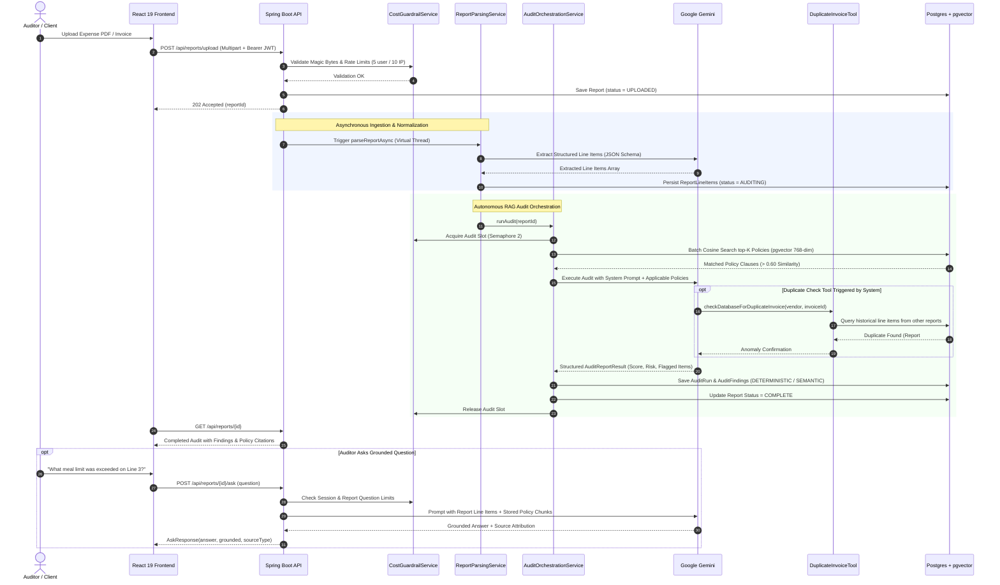

# FinAudit-AI — Autonomous Financial Compliance & Ingestion Audit

[](https://github.com/karanbhati05/FinAudit-AI/actions/workflows/ci.yml)
[](https://openjdk.org/projects/jdk/21/)
[](https://spring.io/projects/spring-boot)
[](https://spring.io/projects/spring-ai)
[](https://ai.google.dev/)
[](https://github.com/pgvector/pgvector)
[](https://react.dev/)
[](https://opensource.org/licenses/MIT)

**FinAudit-AI** is an autonomous enterprise financial compliance copilot. It audits 100% of corporate expense claims, travel vouchers, and vendor invoices against compliance handbooks with zero tolerance for drift. By pairing **Spring AI** and **Google Gemini Flash** with **pgvector** semantic similarity and **deterministic SQL tool calling**, it surfaces invoice duplicates, per-diem violations, and flight class infractions with verbatim policy clause citations and provides a grounded interactive conversational assistant.

---

## 30-Second Recruiter Summary

| Metric / Attribute | Verified Reality |
|---|---|
| **Live Web Application** | [https://fin-audit-ai-xi.vercel.app](https://fin-audit-ai-xi.vercel.app) *(1-Click Instant Demo, No Signup Required)* |
| **Backend API Health** | [https://finaudit-api-4yu2.onrender.com/actuator/health](https://finaudit-api-4yu2.onrender.com/actuator/health) *(Docker on Render)* |
| **Interactive API Docs** | [https://finaudit-api-4yu2.onrender.com/swagger-ui.html](https://finaudit-api-4yu2.onrender.com/swagger-ui.html) |
| **Automated Test Suite** | **91 automated tests passing** (87 in `finaudit-api`, 4 in `finaudit-core`, 0 failures) |
| **Service Code Coverage** | **81% instruction coverage** across core service layer (`com.finaudit.api.service`) via JaCoCo |
| **REST Endpoints** | **12 production REST endpoints** across 4 modular Spring Boot controllers |
| **Architectural Modules** | 3 (`finaudit-core` domain models, `finaudit-api` orchestration engine, `frontend` React SPA) |
| **Embedding Dimensions** | Calibrated **768 dimensions** using Google `gemini-embedding-001` with Matryoshka reduction |
| **Grounded Scoped Chat** | Sub-second report Q&A with strict refusal boundaries and source citation attribution |
| **Interview Notes** | Full architectural walkthrough & debugging stories in [`docs/INTERVIEW_NOTES.md`](docs/INTERVIEW_NOTES.md) |

---

## Application Previews

### 1. Landing Page & Zero-Friction Demo Access


### 2. Audit Operations Dashboard (Spend & Risk Trends, Leaderboards, Histograms)


### 3. Report Detail View (Radial Score Gauge, Policy Citations, Annotated Line Items)


---

## Key Capabilities & Highlights

### 1. Autonomous Multi-Stage Ingestion & Audit Pipeline
- Asynchronous document parsing using **Java 21 Virtual Threads** and **Apache PDFBox**.
- Structured JSON extraction turning unstructured receipt/invoice text into normalized line items.
- Dual-pass audit strategy combining semantic RAG retrieval with deterministic SQL integrity tools.

### 2. Grounded Scoped Chat Assistant (`POST /api/reports/{id}/ask`)
- Conversational Q&A strictly bound to the specific report's extracted line items, findings, and retrieved policy clauses.
- **Zero Hallucination Refusal**: Programmed with strict system boundaries (`"That's not something I can answer from this report's data."`) when queried outside the document scope.
- **Source Attribution**: Returns source classifications (`LINE_ITEM`, `POLICY`, `FINDING`, `NONE`) so auditors can verify exact supporting evidence.
- **Zero Vector Overhead**: Reuses policy chunks retrieved during initial ingestion, avoiding redundant vector store roundtrips.

### 3. Executive Report Detail Redesign
- **Radial Compliance Gauge**: Visual score presentation (0–100) paired with an executive narrative summary.
- **Deterministic Arithmetic One-Liner**: Summary metrics (*"X of Y line items flagged, $Z total flagged amount"*) calculated entirely in Java, eliminating LLM counting/summation errors.
- **Annotated Line Items**: Color-coded severity left borders (`CRITICAL`, `HIGH`, `MEDIUM`, `LOW`), status badges, and expandable inline policy citations.
- **Audit PDF Export**: Downloadable executive audit summary reports.

### 4. Portfolio Spend & Risk Visualizations
- **Spend & Risk Trend**: Time-series visualization of total spend audited per week/month with a stacked area risk distribution beneath it (Recharts).
- **Top Flagged Policies Leaderboard**: Aggregation of violations grouped by policy clause, identifying recurrent operational infractions.
- **Compliance Score Histogram**: 0–100 score distribution showing portfolio compliance health at a glance.
- **Dynamic Date Filtering**: Filter dashboard metrics across Last 7 Days, 30 Days, 90 Days, or All Time, backed by TanStack React Query caching.

### 5. Deterministic Fraud Prevention & Function Calling
- Detects duplicate invoice submissions across historical filings with `DuplicateInvoiceDetectionTool`.
- Cross-references historical line items in PostgreSQL with zero LLM hallucination risk.

### 6. Production Resilience & Cost Guardrails
- **Concurrency Limiting**: In-memory semaphore bounding simultaneous LLM audits to 2 concurrent slots.
- **Multi-Tier Rate Limiting**: Per-user limit (5 audits/day), per-IP limit (10 audits/day), and session chat limit (5 questions/session, 10/report).
- **Quota Circuit Breaker**: Hard cap on daily LLM calls (100 calls/day default) preventing unexpected API billing runaways.
- **Automated Pipeline Watchdog**: Scheduled watchdog inspecting in-flight audits and auto-failing jobs stalled past 2 minutes.

---

## Technology Stack

| Domain | Technologies |
|---|---|
| **Backend Core** | Java 21 LTS, Spring Boot 3.4.3, Spring AI (1.0.0-M6), Project Lombok, Virtual Threads |
| **AI Models** | Google Gemini (Structured JSON Inference & Chat), `gemini-embedding-001` (768-dim embeddings) |
| **Database & Search** | PostgreSQL 16, `pgvector` (HNSW Cosine Indexing), Flyway Migrations |
| **Security & Auth** | Stateless JWT (JJWT 0.12.6), Spring Security, Role-Based Access Control (`AUDITOR`, `VIEWER`) |
| **Document Processing** | Apache PDFBox, Multipart Streaming, Magic-byte MIME validation |
| **Frontend SPA** | React 19, TypeScript, Vite, Tailwind CSS, TanStack Query v5, Recharts, Framer Motion, Lucide Icons |
| **Testing & Quality** | JUnit 5, Mockito, AssertJ, Spring MockMvc, Testcontainers, JaCoCo (81% service coverage) |
| **Cloud & DevOps** | Docker multi-stage builds, Render (Backend + Postgres), Vercel (Frontend), GitHub Actions |

---

## Project Structure

```
FinAudit-AI/
├── finaudit-core/               # Pure Java domain models, DTOs & contracts (zero framework deps)
│   └── src/main/java/com/finaudit/core/model/
│       ├── AskRequest.java & AskResponse.java
│       ├── DashboardSummaryResponse.java
│       ├── ReportDetailResponse.java
│       └── AuditReportResult.java
├── finaudit-api/                # Spring Boot 3.4 API, Spring AI orchestration & security
│   ├── src/main/java/com/finaudit/api/
│   │   ├── controller/          # REST Controllers (Report, Dashboard, Auth, Observability)
│   │   ├── service/             # Audit, Parsing, Ingestion, Q&A, Guardrails, Cleanup
│   │   ├── tool/                # Spring AI Deterministic Tools (Duplicate Invoice Detection)
│   │   ├── repository/          # Spring Data JPA + pgvector Repositories
│   │   └── security/            # JWT filters, UserDetailsService, RBAC
│   └── src/main/resources/
│       ├── db/migration/        # Flyway schema migrations (V1, V2 pgvector, V3)
│       ├── policies/            # Corporate spending compliance policy markdown
│       └── application.yml      # Configuration with local, docker, and prod profiles
├── frontend/                    # Modern React 19 + TypeScript + Vite SPA client
│   ├── src/
│   │   ├── components/          # Dashboard charts, report widgets, UI primitives, scoped chat
│   │   ├── pages/               # Landing, Dashboard, Report Detail, Upload, Auth
│   │   └── services/            # Axios API clients, TanStack Query hooks
│   └── vite.config.ts           # Route-split build setup (<200KB initial chunk)
├── docs/                        # Architecture guides, screenshots, and interview notes
│   ├── INTERVIEW_NOTES.md       # Comprehensive deep-dive on design trade-offs
│   ├── UPTIME_MONITORING.md     # Production health & telemetry documentation
│   └── screenshots/             # Production UI captures
├── docker-compose.yml           # Local pgvector PostgreSQL container
├── render.yaml                  # Turnkey Render Blueprint specification
└── pom.xml                      # Multi-module Maven build descriptor
```

---

## Production REST API Reference

| Method | Endpoint | Access Role | Description |
|---|---|---|---|
| `POST` | `/api/auth/register` | Public | Register new user account with initial role |
| `POST` | `/api/auth/login` | Public | Authenticate user credentials and return Bearer JWT |
| `POST` | `/api/reports/upload` | `ROLE_AUDITOR` | Upload expense report (PDF / TXT) for asynchronous audit |
| `GET` | `/api/reports` | `ROLE_AUDITOR`, `ROLE_VIEWER` | List audit reports with status, compliance scores, and pagination |
| `GET` | `/api/reports/{id}` | `ROLE_AUDITOR`, `ROLE_VIEWER` | Retrieve detailed audit results, findings, and verbatim policy citations |
| `POST` | `/api/reports/{id}/ask` | `ROLE_AUDITOR`, `ROLE_VIEWER` | Grounded conversational Q&A on report line items and matched rules |
| `GET` | `/api/reports/{id}/pdf` | `ROLE_AUDITOR`, `ROLE_VIEWER` | Download formatted PDF executive summary of the completed audit |
| `POST` | `/api/reports/{id}/share` | `ROLE_AUDITOR` | Generate time-bounded public share token for read-only access |
| `GET` | `/api/public/reports/share/{token}` | Public | Public read-only access to an audited report via share token |
| `GET` | `/api/dashboard/summary` | `ROLE_AUDITOR`, `ROLE_VIEWER` | Portfolio aggregations: spend trends, leaderboard, score histogram, date filter |
| `GET` | `/api/admin/observability/metrics` | `ROLE_ADMIN` | Inspect guardrail telemetry, daily quota usage, and error metrics |
| `GET` | `/actuator/health` | Public | Spring Boot Actuator container healthcheck probe |

---

## Quick Start (Run Locally in 5 Minutes)

### 1. Clone the Repository
```bash
git clone https://github.com/karanbhati05/FinAudit-AI.git
cd FinAudit-AI
```

### 2. Start PostgreSQL with pgvector (Docker Compose)
```bash
docker compose up -d postgres
```
*PostgreSQL 16 with `pgvector` will start on port `5434`.*

### 3. Launch the Backend API
Set your Google Gemini API key and run the Spring Boot application:
```bash
# Windows PowerShell
$env:GEMINI_API_KEY="your-gemini-api-key"
mvn spring-boot:run -pl finaudit-api

# Linux / macOS
export GEMINI_API_KEY="your-gemini-api-key"
mvn spring-boot:run -pl finaudit-api
```
*API will start at `http://localhost:8080`. Healthcheck: `http://localhost:8080/actuator/health`.*

### 4. Launch the Frontend SPA
```bash
cd frontend
npm install
npm run dev
```
*Open `http://localhost:5173` in your browser. Click **"View Live Demo"** to log straight into the pre-populated demo account without registering.*

---

## Architectural Sequence Flow



---

## Production Deployment Blueprint

### Render Turnkey Blueprint
The repository includes a production-ready [`render.yaml`](render.yaml) specification:
1. Connect your repository fork to Render.
2. Select **New + -> Blueprint**.
3. Set the `GEMINI_API_KEY` environment secret.
4. Render deploys:
   - Managed PostgreSQL 16 with native `pgvector`
   - Multi-stage Docker containerized Spring Boot backend
   - Static Vite React frontend with automatic SPA rewrites

---

## Technical Deep Dive & Interview Documentation

For an in-depth technical analysis covering architectural trade-offs, security postures, the `gemini-embedding-001` Matryoshka dimension calibration story, and SDET testing strategies:

👉 [**`docs/INTERVIEW_NOTES.md`**](docs/INTERVIEW_NOTES.md)

---

## License

Distributed under the MIT License. See `LICENSE` for details.
