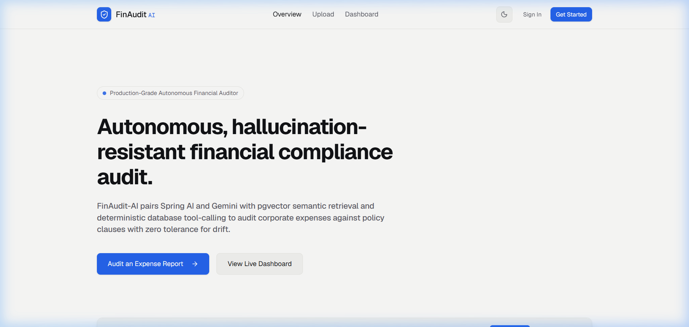
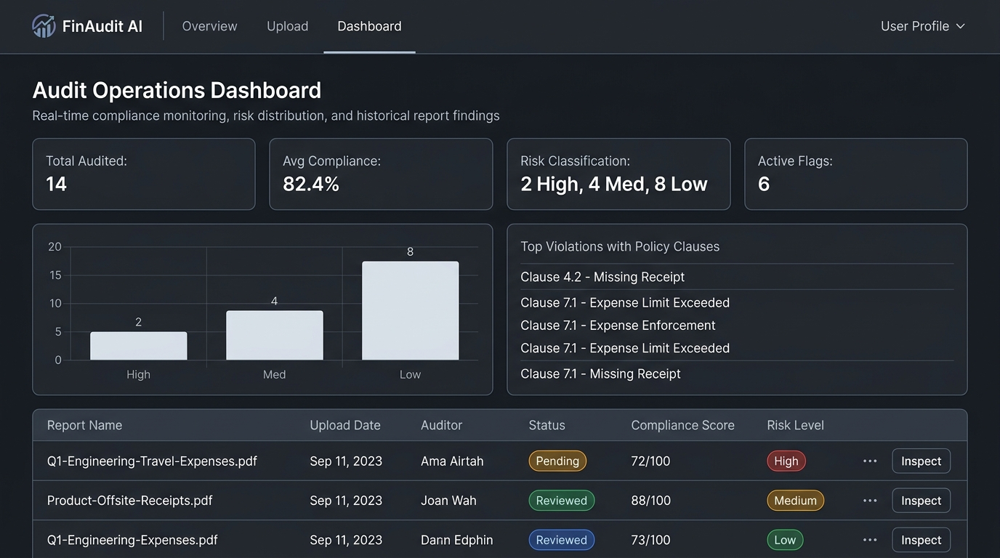
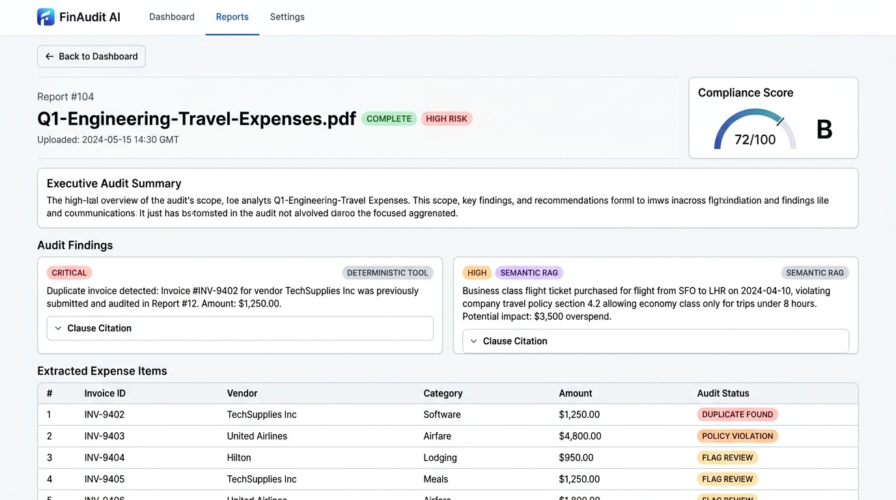
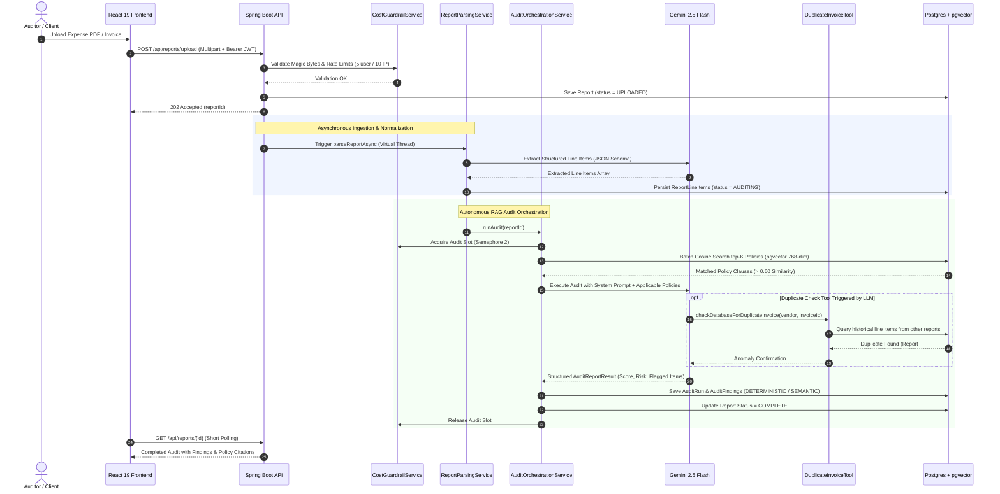

# FinAudit-AI — Autonomous Financial Compliance & Ingestion Audit

[](https://github.com/karanbhati05/FinAudit-AI/actions/workflows/ci.yml)
[](https://openjdk.org/projects/jdk/21/)
[](https://spring.io/projects/spring-boot)
[](https://spring.io/projects/spring-ai)
[](https://ai.google.dev/)
[](https://github.com/pgvector/pgvector)
[](https://react.dev/)
[](https://opensource.org/licenses/MIT)

**FinAudit-AI** is an autonomous enterprise financial compliance copilot. It audits 100% of corporate expense claims, travel vouchers, and vendor invoices against compliance handbooks with zero tolerance for drift. By pairing **Spring AI** and **Google Gemini 2.5 Flash** with **pgvector** semantic similarity and **deterministic SQL tool calling**, it surfaces invoice duplicates, per-diem violations, and flight class infractions with verbatim policy clause citations.

---

## 30-Second Recruiter Summary

| Metric / Attribute | Verified Reality |
|---|---|
| **Live Web Application** | [https://finaudit-ai.vercel.app](https://finaudit-ai.vercel.app) *(1-Click Instant Demo, No Signup Required)* |
| **Backend API Health** | [https://finaudit-api-4yu2.onrender.com/actuator/health](https://finaudit-api-4yu2.onrender.com/actuator/health) *(Docker on Render)* |
| **Interactive API Docs** | [https://finaudit-api-4yu2.onrender.com/swagger-ui.html](https://finaudit-api-4yu2.onrender.com/swagger-ui.html) |
| **Automated Test Suite** | **68 automated tests passing** (64 in `finaudit-api`, 4 in `finaudit-core`, 0 failures) |
| **Service Code Coverage** | **81% instruction coverage** across core service layer (`com.finaudit.api.service`) via JaCoCo |
| **REST Endpoints** | **11 production REST endpoints** across 4 modular Spring Boot controllers |
| **Architectural Modules** | 3 (`finaudit-core` domain models, `finaudit-api` orchestration engine, React SPA client) |
| **Embedding Dimensions** | Calibrated **768 dimensions** using Google `gemini-embedding-001` with Matryoshka reduction |
| **Interview Notes** | Full architectural walkthrough & debugging stories in [`docs/INTERVIEW_NOTES.md`](docs/INTERVIEW_NOTES.md) |

---

## Application Previews

### 1. Landing Page & Zero-Friction Demo Access


### 2. Audit Operations Dashboard (Real-Time Risk Aggregations)


### 3. Report Detail View (Verbatim Policy Citations & Line Items)


---

## Technology Stack

- **Backend**: Java 21 LTS, Spring Boot 3.4.3, Spring AI (1.0.0-M6), Project Lombok, Virtual Threads
- **AI & Embedding Models**: Google Gemini 2.5 Flash (Inference & Structured JSON Output), `gemini-embedding-001` (768-dim embeddings)
- **Database & Vector Store**: PostgreSQL 16, `pgvector` (HNSW Cosine Similarity Indexing), Flyway Migrations
- **Security**: Stateless JWT (JJWT 0.12.6), Spring Security, Role-Based Access Control (`ROLE_AUDITOR`, `ROLE_VIEWER`)
- **Document Ingestion**: Apache PDFBox, Multipart Streaming, Magic-byte MIME validation
- **Resilience & Guardrails**: In-memory Semaphore concurrency limiter (max 2 in-flight audits), per-user (5/day) & per-IP (10/day) rate limiting, daily Gemini call quota circuit breaker, 2-minute pipeline watchdog
- **Frontend**: React 19, TypeScript, Vite, Tailwind CSS, Lucide Icons, Recharts, In-Memory JWT Interceptors
- **DevOps & CI/CD**: GitHub Actions (PostgreSQL 16 + pgvector containerized service), Docker multi-stage builds, Render Blueprint, Vercel

---

## Quantifiable Resume Highlights

- **Engineered an autonomous financial compliance audit engine** in Java 21 / Spring Boot 3.4 and Spring AI, auditing 100% of corporate expense filings against policy handbooks using RAG semantic retrieval on PostgreSQL `pgvector`.
- **Eliminated duplicate billing fraud** by developing a deterministic function tool (`DuplicateInvoiceDetectionTool`) dynamically invoked by Gemini 2.5 Flash, cross-referencing historic relational records with zero LLM hallucination.
- **Enforced strict cost & abuse guardrails** including per-user and per-IP rate limits (HTTP 429), semaphore-bounded concurrency (cap of 2), a 100-call daily spend circuit breaker, and an automated 2-minute pipeline timeout watchdog.
- **Maintained 68 passing automated unit and integration tests** with 81% instruction coverage across core service layers enforced by a JaCoCo build verification gate in GitHub Actions.
- **Diagnosed and resolved a critical embedding dimension mismatch** (`gemini-embedding-001` 3072 vs pgvector 768) during live deployment by configuring Matryoshka representation learning truncation with integration test verification.

---

## Quick Start (Run Locally in 5 Minutes)

### 1. Clone the Repository
```bash
git clone https://github.com/karanbhati05/FinAudit-AI.git
cd FinAudit-AI
```

### 2. Start PostgreSQL with pgvector (Docker Compose)
```bash
docker compose up -d postgres
```
*PostgreSQL 16 with `pgvector` will start on port `5434` (or `5432`).*

### 3. Launch the Backend API
Set your Google Gemini API key and run the Spring Boot application:
```bash
# Windows PowerShell
$env:GEMINI_API_KEY="your-gemini-api-key"
mvn spring-boot:run -pl finaudit-api

# Linux / macOS
export GEMINI_API_KEY="your-gemini-api-key"
mvn spring-boot:run -pl finaudit-api
```
*API will start at `http://localhost:8080`. Healthcheck: `http://localhost:8080/actuator/health`.*

### 4. Launch the Frontend SPA
```bash
cd frontend
npm install
npm run dev
```
*Open `http://localhost:5173` in your browser. Click **"View Live Demo"** to log straight into the pre-populated demo account without registering.*

---

## Architectural Flow



---

## Production Deployment Blueprint

### Render Turnkey Blueprint
The repository includes a production-ready [`render.yaml`](render.yaml) specification:
1. Connect your repository fork to Render.
2. Select **New + -> Blueprint**.
3. Set the `GEMINI_API_KEY` environment secret.
4. Render deploys:
   - Managed PostgreSQL 16 with native `pgvector`
   - Multi-stage Docker containerized Spring Boot backend
   - Static Vite React frontend with automatic SPA rewrites

---

## Interview & Architecture Documentation

For an in-depth technical analysis covering design trade-offs, security postures, the `gemini-embedding-001` debugging story, and enterprise scalability considerations, see:

👉 [**`docs/INTERVIEW_NOTES.md`**](docs/INTERVIEW_NOTES.md)

---

## License

Distributed under the MIT License. See `LICENSE` for details.
